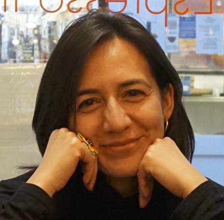

## About Me

Hello! Hallo! Halo! I am Vanessa Aisyahsari Hanschke (Pronouns: she/her), Associate Lecturer in Human-Computer Interaction at the UCL Interaction Centre. Previously, I completed my PhD with the [Interactive Artificial Intelligence CDT](https://www.bristol.ac.uk/cdt/interactive-ai/) at the University of Bristol under the supervision of
[Dr. Paul Marshall](https://www.bristol.ac.uk/people/person/Paul-Marshall-36d4dfa7-1ec3-4168-9226-130e47809b65/)).

## Research Interest

I am currently exploring how developers can be encouraged to reflect on the ethical aspects of their data and AI practise. My wider research interests include:

* Ethical literacy for data and AI practitioners
* Data and AI ethics, responsible AI, explainable AI
* AI literacy for non-experts
* Speculative design and storytelling methods

## News

Check out our [paper](https://doi.org/10.1016/j.jrt.2025.100110) in the Journal of Responsible Technology about the Data Hazards project. 

Would you like to test your responsible AI practice? I am looking for data and/or AI developer teams (data scientists, AI/ML engineers, etc.) More info [here](/deed)

